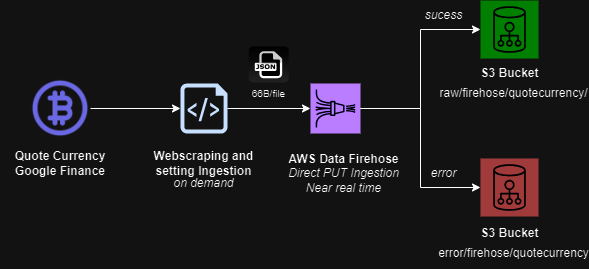

## Overview
Python script for scraping Bitcoin quotes from google finance webpage, including the current value, date and time of the quote. The code simulates an ingestion in near real-time, on demand, allowing the configuration of quantity of records and request timing. The project architecture uses AWS cloud resources such as Firehose and S3.

**Project Archicteture**

## Project
To run the project use this tutorial:

*In same path of the file pyproject.toml:*
```py
poetry install
```
Set the configurations of ingestion, in `main.py` file.

*This is an example for currency bitcoin, brazilian real exchange, 10 ammount of data and 120 seconds for interval for capture quotation. For this quote, google finance website updates currency price every 2 min.*
```py
ingest_data('BTC', 'BRL', 10, 120)
```
Then, finally run the script:
```py
task run
```
File example in destination (json):
```json
{"current_price": "367,321.39", "ing_date": "2024-07-23 17:50:23"}
```
## Important 
For this project runs is necessary to set up AWS CLI v2 and configure authentication credentials for your AWS account before using Boto3. See documentation:
[AWS CLI](https://aws.amazon.com/cli/) and
[Configuration Auth Credentials for AWS account](https://boto3.amazonaws.com/v1/documentation/api/latest/guide/quickstart.html#configuration)

*It is important to highlight that AWS is a cloud platform that has associated costs for using resources. See:*
[AWS Pricing Calculator](https://calculator.aws/#/)


